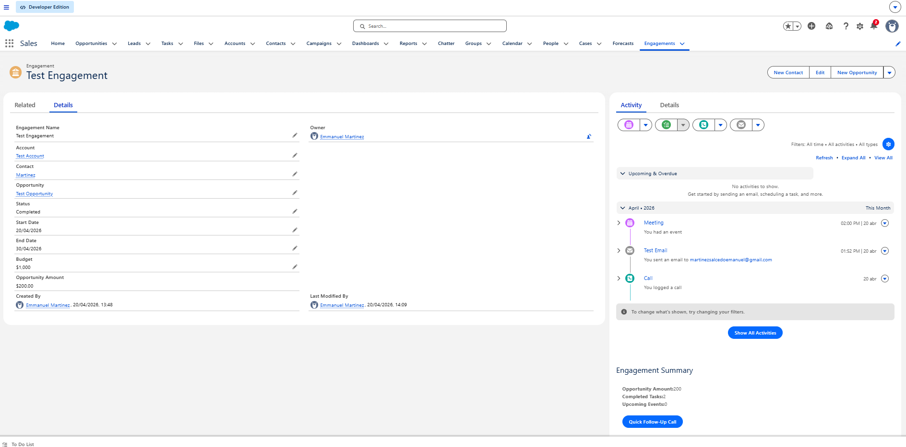
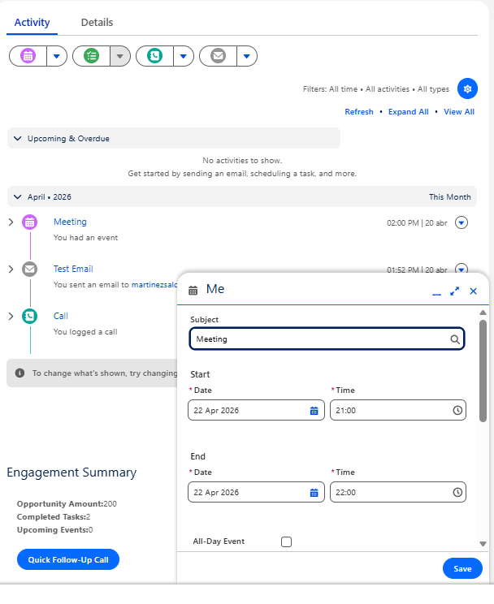
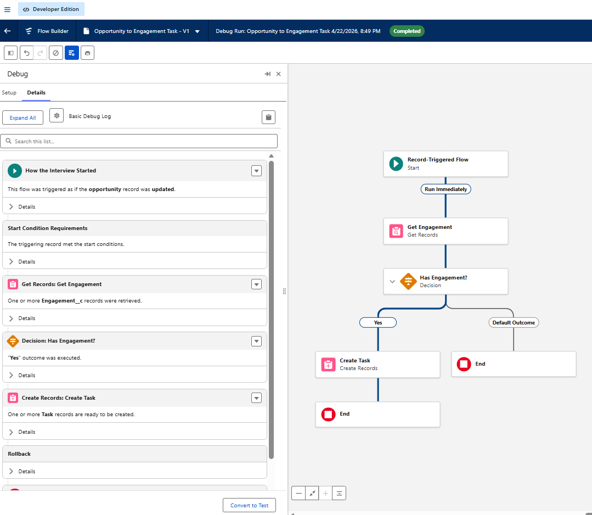
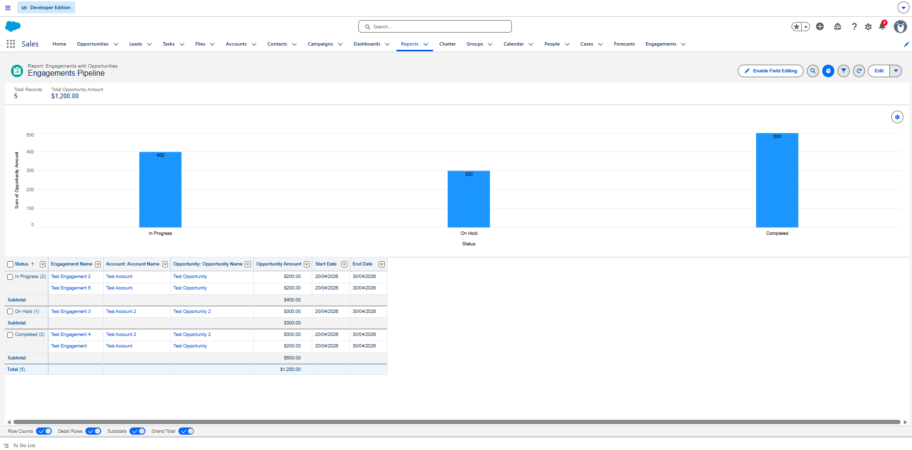
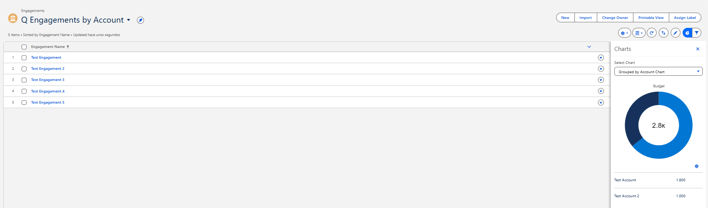

# Engagement Management – Salesforce Technical Assessment

## Development

### 3. Activities (calls, emails, events)

- I enabled Activities on Engagement (Setup → Object Manager → Allow Activities), created a custom tab (Setup → Tabs), and added it to the Sales app main screen.
- It is assumed that the Activity Timeline and Sales app navigation are visible to users.
- To test, open the Sales app → Engagements tab, open a record, use "Log a Call", "Email" or "New Event" and verify they appear in the Activity Timeline.

### 4. Lightning App Builder (record page) + custom tab

- I customized the Engagement record page (Engagements → Setup (Top gear icon) → Edit Page which uses Lightning App Builder), even though some components already exist by default (such as the Activity Timeline) I added Related Lists and the engagementSummary LWC then set it as the default page.  
- To test, open the Engagements tab and verify the layout, activities, and LWC component are displayed correctly.

### 5. List views (with list view chart)

- I created two list views ( Engagements → List View Controls → New ) then configured filters and charts: "My Open Engagements" (Status ≠ Completed, Owner = Me) and "Q Engagements by Account" (grouped by Account with a donut chart based on Budget).  
- To test, go to the Engagements tab, switch between both list views and verify the filters, grouping and chart are displayed correctly.

### 6. LWC + Apex (self-learning focus)

- I built an LWC called "engagementSummary" (created via Salesforce CLI, logging in and using VS Code extensions to create the project, then added to the record page similar to Lightning App Builder components) that reads the current record using recordId, shows Opportunity Amount, completed Tasks and upcoming Events, and uses Apex to fetch data and create a follow-up Task.  
- To test, open the Engagements tab, open a record, verify the values shown in the component, click "Quick Follow-Up Call" and check that a new Task appears in the Activity Timeline.

### 7. Flow automation

- I created a Record-Triggered Flow (Setup → Flows → New Flow) that runs when Stage changes to "Negotiation/Review", gets one related Engagement and creates a Task ("Prepare proposal", Due Date +2 days, Priority High), meaning only ONE task will be created even if multiple Engagements are linked to the Opportunity.
- It is assumed that the Opportunity is linked to at least one Engagement and that the Stage change condition is met.  
- To test, open an Opportunity, change Stage to "Negotiation/Review" and verify that a new Task appears in one of the related Engagement Activity Timeline.

### 8. Reporting

- I created a custom report type and built a report "Engagement Pipeline" (Reports tab → New Report) including Engagement Name, Account, Status, Opportunity, Opportunity Amount, Start Date and End Date, then added a bar chart (Sum of Opportunity Amount grouped by Status) and also included it in a Dashboard (Dashboard tab → New Dashboard).  
- It is assumed that Engagements are linked to Opportunities with populated Amount values.  
- To test, open the "Engagement Pipeline" report, verify the columns and chart, and confirm that the values reflect the Engagement and Opportunity data.

## Links to LWC and Apex classes

## Report and list view names

**Report**
- Engagement Pipeline

**List Views**
- My Open Engagements
- Q Engagements by Account

## Screenshots

- Engagement record page

- Logging a call / email / event

- The flow firing

Flow execution shown from Debug view.

- The report + chart

- List view chart

